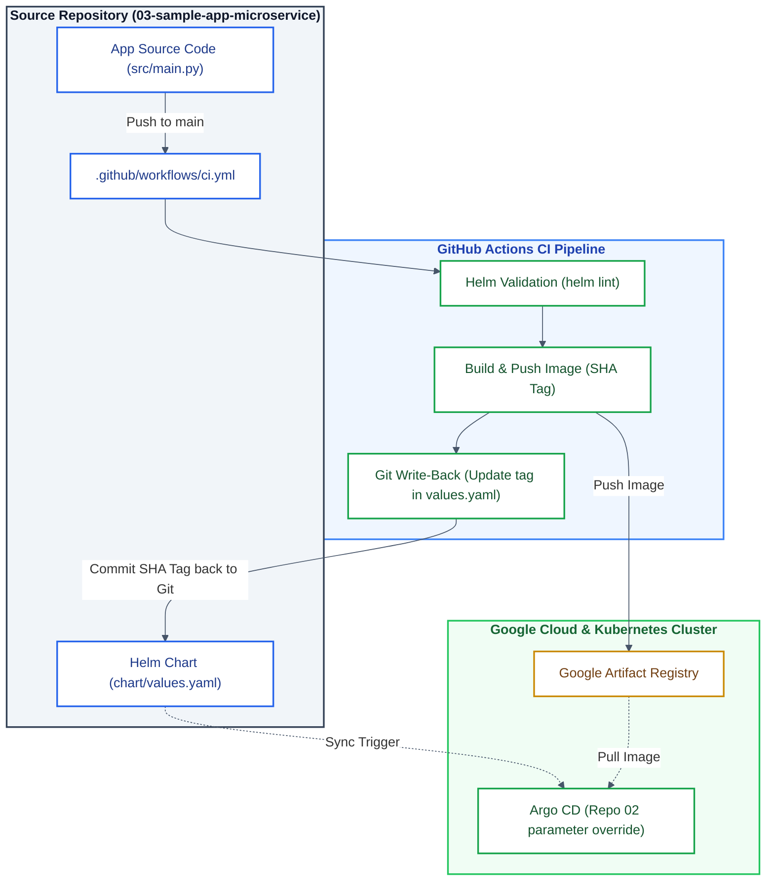

# [3/3] Cloud-Native Microservice — Docker, Helm Packaging & GitHub Actions CI

[](https://www.docker.com/)
[](https://helm.sh/)
[](https://github.com/features/actions)
[](https://cloud.google.com/artifact-registry)
[](https://kubernetes.io/)

> **Application Workload:** A lightweight Python microservice packaged with Docker and Helm, featuring automated CI verification, automated Git tag write-back via GitHub Actions, and clean GitOps decoupling for GKE.

---

## Executive Summary

This repository contains the microservice application workload (Project 3 of 3) for the Cloud-Native platform. It provides the application source code (`src/main.py`), containerization config, and Helm chart manifests (`chart/`). 

Integration with GitHub Actions ensures static chart analysis (`helm lint`), keyless authentication with GCP via Workload Identity Federation (WIF), and image compilation pushed directly to Google Artifact Registry. Upon build completion, the pipeline automatically writes back the new image commit-SHA tag into `chart/values.yaml` so Argo CD instantly detects and reconciles state changes.

---

## Key Features & Platform Standards

* **Containerized Microservice:** Python application containerized via multi-stage build.
* **Helm 3 Packaging:** Declarative chart definition (`chart/`) managing Deployment and Service resources.
* **Automated Git Tag Write-Back:** CI pipeline updates the image `tag` directly in `chart/values.yaml` using the commit SHA, maintaining Git as the Single Source of Truth.
* **Clean GitOps Decoupling:** The Helm chart repository reference remains agnostic (`sample-app`), while environment-specific Google Artifact Registry paths are injected via Helm parameter overrides in **`02-platform-gitops-config`**.
* **Keyless GCP Auth:** Keyless authentication in GitHub Actions via Workload Identity Federation (WIF).

---

## Architecture Diagram



---

## Repository Structure

```text
.
├── .github/
│   └── workflows/
│       └── ci.yml             # GitHub Actions CI workflow (Build, Push & Git Tag Write-Back)
├── chart/                     # Helm chart configuration
│   ├── templates/             # Kubernetes resource templates (Deployment, Service)
│   ├── Chart.yaml             # Helm chart metadata
│   └── values.yaml            # Deployment variables (Updated automatically by CI)
├── src/
│   ├── main.py                # Microservice application code
│   └── requirements.txt       # Python dependencies
├── Dockerfile                 # Multi-stage Docker build file
├── LICENSE
└── README.md
```

---

## CI Pipeline & GitOps Automation

Whenever code is pushed to `main`, `.github/workflows/ci.yml` performs the following automated steps:

1. **Linting:** Runs `helm lint` against the chart directory.
2. **Authentication:** Authenticates to GCP using Workload Identity Federation (WIF).
3. **Build & Push:** Builds the Docker container tagged with `${{ github.sha }}` and pushes it to Artifact Registry.
4. **Git Write-Back:** Updates `image.tag` in `chart/values.yaml` with the commit SHA and commits back to `main` with `[skip ci]`.

---

## Local Development & Testing Quickstart

### Prerequisites

* Docker Desktop with Kubernetes enabled.
* Helm 3 installed (`brew install helm`).
* `kubectl` configured.

### 1. Deploy Locally with Helm

```bash
# Switch context to local Kubernetes
kubectl config use-context docker-desktop

# Install Helm release
helm install sample-app chart/
```

### 2. Verify Endpoint

```bash
kubectl get pods
curl http://localhost:80
```

**Expected Output:**
```json
{"status":"online","message":"Operational API"}
```

---

## Platform Ecosystem

This repository is **Part 3 of 3** in the Cloud-Native End-to-End Platform series:

1. [**`01-platform-infra-terraform`**](https://github.com/vladimir-evdokimov-pro/01-platform-infra-terraform) — Base cloud infrastructure provisioning (VPC, GKE Private, Artifact Registry).
2. [**`02-platform-gitops-config`**](https://github.com/vladimir-evdokimov-pro/02-platform-gitops-config) — GitOps engine and cluster configurations (Argo CD, Helm Parameter Overrides).
3. **`03-sample-app-microservice`** *(This repository)* — Workload application code, Dockerfile, Helm packaging, and CI automation pipeline.