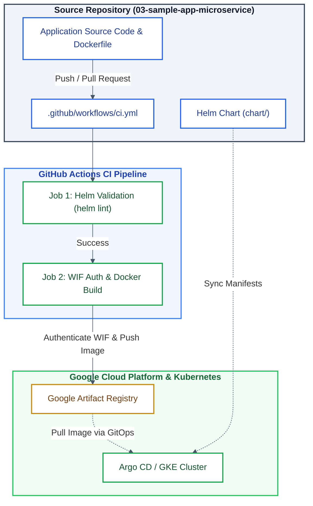

# [3/3] Cloud-Native Microservice — Docker, Helm Packaging & GitHub Actions CI

[](https://www.docker.com/)
[](https://helm.sh/)
[](https://github.com/features/actions)
[](https://cloud.google.com/artifact-registry)
[](https://kubernetes.io/)

> **Application Workload:** A lightweight, production-ready microservice packaged with Docker and Helm, featuring automated CI verification via GitHub Actions (Workload Identity Federation) for seamless GitOps deployment on Private GKE.

---

## Executive Summary

This repository contains the microservice application workload (Project 3 of 3) for the Cloud-Native platform. It provides the application source code, Docker containerization setup, and Helm chart manifests. Integration with GitHub Actions ensures automated static chart analysis (`helm lint`), keyless authentication with GCP using Workload Identity Federation (WIF), and automated image builds pushed directly to Google Artifact Registry for GitOps synchronization via Argo CD.

---

## Key Features & Platform Standards

* **Containerized Workload:** Optimized multi-stage Docker build producing lightweight and secure container images.
* **Helm 3 Packaging:** Declarative chart definition (`chart/`) managing Deployment, Service, and Ingress resources for Kubernetes.
* **Keyless GCP Authentication:** Secure authentication in GitHub Actions via Workload Identity Federation (WIF), eliminating long-lived service account JSON keys.
* **Automated CI Validation:** Enforced continuous integration pipeline verifying Helm syntax and publishing immutable, commit-SHA-tagged container images.
* **GitOps Alignment:** Designed to be consumed declaratively by Argo CD (managed in **`02-platform-gitops-config`**) for zero-touch cluster deployments.

---

## Architecture Diagram



---

## Repository Structure

```text
.
├── .github/
│   └── workflows/
│       └── ci.yml             # GitHub Actions CI workflow (Helm Lint & Docker Build/Push)
├── chart/                     # Helm chart configuration
│   ├── templates/             # Kubernetes resource templates (Deployment, Service, etc.)
│   ├── Chart.yaml             # Helm chart metadata
│   └── values.yaml            # Default deployment variables
├── Dockerfile                 # Application containerization specification
├── index.js                   # Microservice source code
├── package.json               # Node.js dependencies and script definition
├── LICENSE
└── README.md
```

---

## GitHub Actions CI Pipeline Setup

The repository relies on GitHub Repository Variables for its CI workflow (`.github/workflows/ci.yml`). Configure the following variables in your repository (**Settings > Secrets and variables > Actions > Variables**):

| Variable Name | Description | Example Value |
| :--- | :--- | :--- |
| `GCP_PROJECT_ID` | GCP Project ID | `gke-devsecops-stack-26` |
| `GCP_REGION` | GCP Target Region | `europe-west9` |
| `GCP_ZONE` | GCP Target Zone | `europe-west9-a` |
| `GCP_ARTIFACT_REGISTRY` | Name of the Artifact Registry repo | `sample-app-repo` |
| `GCP_WIF_PROVIDER` | Workload Identity Provider resource name | `projects/123/locations/global/workloadIdentityPools/...` |
| `GCP_WIF_SA` | Service Account email bound to WIF | `github-actions-sa@project.iam.gserviceaccount.com` |

---

## Local Development & Testing Quickstart

### Prerequisites

* Docker Desktop with Kubernetes enabled.
* Helm 3 installed (`brew install helm`).
* `kubectl` configured for local execution.

### 1. Enable Local Kubernetes

In Docker Desktop settings, navigate to **Kubernetes** and click **Enable Kubernetes** / **Create cluster**.

### 2. Deploy Locally with Helm

Set your context to Docker Desktop and install the release:

```bash
# Switch context to local Docker Desktop
kubectl config use-context docker-desktop

# Install Helm release
helm install sample-app chart/
```

### 3. Verify Deployment

Check the running pods and query the application endpoint:

```bash
# Verify pod status
kubectl get pods

# Test local endpoint response
curl http://localhost:80
```

**Expected Output:**
```json
{"status":"online","message":"Operational API"}
```

### 4. Cleanup Local Environment

Uninstall the Helm release when testing is complete:

```bash
helm uninstall sample-app
```

---

## Platform Ecosystem

This repository is **Part 3 of 3** in the Cloud-Native End-to-End Platform series:

1. [**`01-platform-infra-terraform`**](https://github.com/<YOUR_GITHUB_USERNAME>/01-platform-infra-terraform) — Provisioning base cloud infrastructure (VPC, GKE Private, Cloud SQL, Artifact Registry).
2. [**`02-platform-gitops-config`**](https://github.com/<YOUR_GITHUB_USERNAME>/02-platform-gitops-config) — GitOps engine, Kubernetes controllers & cluster configuration (Argo CD, Ingress, Cert-Manager).
3. **`03-sample-app-microservice`** *(This repository)* — Microservice application workloads, Docker containerization, Helm packaging, and CI pipeline.